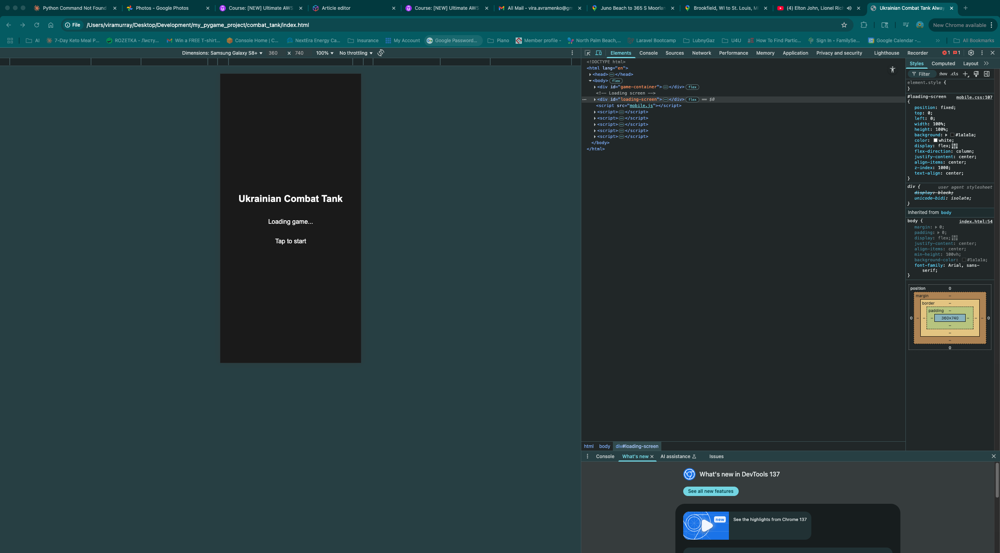

# Combat Tank Game - Screenshots

This directory contains all screenshots captured for the development article.

## Directory Structure

- `gameplay/` - Screenshots of game action and mechanics
- `mobile/` - Mobile version screenshots
- `ui_elements/` - User interface components

## Screenshots

### tank movement

### mobile gameplay

### game ui

### victory screen

## Usage in Article

These screenshots can be embedded in your development article using the markdown syntax shown above.

For web use, you can open `gallery.html` in a browser to view all screenshots in a grid layout.
